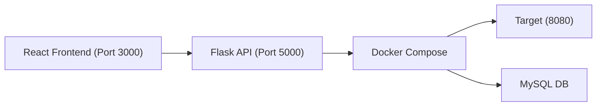

# HackOps Project

**A gamified cybersecurity training platform where Red Team (attackers) and Blue Team (defenders) compete in real-time over dynamically generated vulnerable web applications.**

> 📖 **For comprehensive project documentation**, including detailed architecture, AI training pipeline, and technical implementation details, see **[PROJECT_DOCUMENTATION.md](PROJECT_DOCUMENTATION.md)**

---

## Table of Contents

- [Features](#features)
- [The Concept](#the-concept)
- [Architecture](#architecture)
- [Prerequisites](#prerequisites)
- [Installation](#installation)
- [AI Agent Training](#ai-agent-training)
- [Running the Project](#running-the-project)
- [Using the Application](#using-the-application)
- [Project Structure](#project-structure)
- [API Documentation](#api-documentation)
- [Troubleshooting](#troubleshooting)

---

## The Concept

HackOps is essentially a game where one AI tries to break into a website and another AI tries to fix it in real-time. We are building a smart system that simulates cyber attacks and defenses to help understand and improve software security.

- **Red Agent (Attacker)**: This AI behaves like a hacker. It scans the website, looks for weaknesses, and tries to exploit them.
- **Blue Agent (Defender)**: This AI plays the role of a security engineer. It watches the system, detects anomalies, and patches the holes.

This creates a safe "lab" for students and researchers to experiment with cyber warfare without hurting real systems.

---

## Features

### 🎮 Gameplay Features
- **Dynamic Vulnerability Generation**: Seed-based random vulnerability scenarios for unlimited unique missions
- **Dual-Role Gameplay**: Play as **Red Team** (attacker) or **Blue Team** (defender)
- **Human vs AI**: Compete against intelligent AI opponents trained via Reinforcement Learning
- **Real-Time Competition**: Live scoring system with attack/defense bonuses
- **Interactive Consoles**: Dedicated attack and defense interfaces with guided workflows
- **25+ Vulnerability Types**: SQL Injection, XSS, RCE, LFI, SSRF, XXE, CSRF, IDOR, and more

### 🤖 AI & Machine Learning
- **Reinforcement Learning Agents**: PPO-based agents trained using Stable Baselines3
- **CybORG Integration**: Custom Gymnasium environment wrapping DVWA
- **Intelligent Opponents**: AI agents that learn attack and defense strategies
- **Interactive Training**: Jupyter notebooks with live progress visualization
- **CLI Training Tools**: Headless training scripts for long-running sessions
- **Model Deployment**: Load trained models directly into live missions
- **Comprehensive Logging**: Track AI decision-making process in real-time

### 🎨 User Interface
- **Modern Dashboard**: Dark cyber-themed interface with glassmorphism effects
- **Real-Time Activity Logs**: Monitor DVWA traffic and AI agent decisions
- **Application Architecture View**: Visual map of pages categorized by function
- **Mission Intel Panel**: Track objectives, seed, and mission status
- **AI Control Panel**: Enable/disable AI opponent and monitor its actions
- **Code Editor**: Syntax-highlighted editor for viewing and patching vulnerabilities
- **Responsive Design**: Works seamlessly across different screen sizes

### 🔧 Technical Features
- **Docker-Based Environment**: Fully isolated, reproducible vulnerable targets
- **Session Management**: Track multiple concurrent missions with unique IDs
- **Comprehensive API**: RESTful endpoints for all game actions
- **Vulnerability Injection**: Runtime code modification for dynamic scenarios
- **Exploit Validation**: Automatic verification of attack success
- **Patch Verification**: Validate security fixes before applying
- **Detailed Logging**: Activity, AI, and system logs with timestamps

---

## Architecture



> **Frontend** → Communicates with **Flask API** → Controls **Docker containers** running **DVWA + custom vulnerabilities**

---

## Prerequisites

Ensure you have the following installed on your machine:

- **Docker Desktop (v20.10+)**  
  [Download for Windows](https://www.docker.com/products/docker-desktop/) | [Mac](https://www.docker.com/products/docker-desktop/) | [Linux](https://docs.docker.com/engine/install/)

- **Docker Compose (v2.0+)** – Usually included with Docker Desktop

- **Python 3.8+** – [Download](https://www.python.org/downloads/)

- **Node.js 16+ and npm** – [Download](https://nodejs.org/)

- **Git** – [Download](https://git-scm.com/downloads)

### Verify Prerequisites

```bash
docker --version        # Should show v20.10+
docker-compose --version # Should show v2.0+
python --version        # Should show 3.8+
node --version          # Should show v16+
npm --version           # Should show 8+
```

---

## Installation

### 1. Clone the Repository

```bash
git clone git@github.com:Mahmoud2592004/HackOps.git
cd HackOps
```

> **Note**: Repository name is `HackOps` (not `hackops-project`)

---

### 2. Set Up Python Virtual Environment (Flask API & AI Training)

**Windows:**

```bash
cd api
python -m venv venv
venv\Scripts\activate
pip install -r requirements.txt
cd ..
```

**macOS/Linux:**

```bash
cd api
python3 -m venv venv
source venv/bin/activate
pip install -r requirements.txt
cd ..
```

---

### 3. Set Up React Frontend

```bash
cd frontend
npm install
cd ..
```

---

### 4. Create Required Directories

```bash
# Create logs and config directories
mkdir -p logs config
```

---

### 5. Verify DVWA Files

Ensure the `dvwa` directory contains the **Damn Vulnerable Web Application** source code. If missing:

```bash
# Clone DVWA into the project
git clone https://github.com/digininja/DVWA.git dvwa
```

---

## AI Agent Training
 
The project includes a complete environment for training Reinforcement Learning agents using the CybORG simulator.
 
### Prerequisites
- Python 3.10+
- Stable Baselines3 installed (included in `requirements.txt`)
 
### How to Train
You can train agents using either the interactive notebook or the command line.
 
#### Option A: Jupyter Notebook (Recommended)
1. Navigate to the `api/` folder: `cd api`
2. Launch Jupyter: `jupyter notebook`
3. Open `HackOps_Training.ipynb`
4. Use the interactive controls to train Blue or Red agents.
 
#### Option B: Command Line Script
For automated or headless training, use `train_sb3.py`.
 
**Train a Blue Defender:**
```bash
cd api
python train_sb3.py --agent blue --timesteps 100000
```
 
**Train a Red Attacker:**
```bash
python train_sb3.py --agent red --timesteps 100000
```
 
---
 
## Running the Project

### Step 1: Start Docker Containers

From the project root directory:

```bash
docker-compose up -d --build
```

This will:
- Build the vulnerable target container
- Start MariaDB database
- Generate random vulnerabilities
- Apply vulnerabilities to the environment

> **Wait 30–60 seconds** for containers to fully initialize.

Verify containers are running:

```bash
docker-compose ps
```

You should see:

```
hackops-project-target-1 (Up, port 8080)
hackops-project-db-1     (Up)
```

---

### Step 2: Start Flask API

Open a **new terminal** and activate the virtual environment:

**Windows:**

```bash
cd api
venv\Scripts\activate
python app.py
```

**macOS/Linux:**

```bash
cd api
source venv/bin/activate
python app.py
```

> The API should start on [http://localhost:5000](http://localhost:5000)

---

### Step 3: Test the API (Optional but Recommended)

In another terminal, with the virtual environment activated:

```bash
cd api
python test_api.py
```

This runs a comprehensive test suite verifying all endpoints.

---

### Step 4: Start React Frontend

Open a **new terminal**:

```bash
cd frontend
npm start
```

> The React app will open automatically at [http://localhost:3000](http://localhost:3000)

---

## Using the Application

### Starting a Mission

1. **Access the Dashboard**: Open [http://localhost:3000](http://localhost:3000) in your browser  
2. **Choose Your Role**: Select **Red Team** (attacker) or **Blue Team** (defender)  
3. **Configure Mission**: Enter an optional **seed** for reproducible scenarios  
4. **Start Mission**: Click **"Launch Mission"** to begin  

### Playing the Game

**As Red Team (Attacker)**:
- Select target pages from the application
- Choose attack vectors (SQLi, XSS, RCE, etc.)
- Enter exploit payloads (hints provided)
- Test attacks against live DVWA instance
- Earn points for successful exploits

**As Blue Team (Defender)**:
- Scan pages for vulnerabilities
- Review discovered security flaws
- View vulnerable code in the editor
- Apply security patches
- Validate fixes before deployment
- Earn bonus points for proactive defense

### Using the AI Opponent

5. **Enable AI**: Toggle the AI Control Panel (bottom-right) to activate your opponent
6. **Monitor AI**: Watch the AI Agent Activity log to see its decision-making process
7. **Compete**: The AI will automatically take actions every 5-10 seconds
8. **Learn**: Observe AI strategies and improve your own gameplay

### Additional Features

9. **Access Vulnerable Target**: Visit [http://localhost:8080](http://localhost:8080) to test exploits live  
10. **View Real-Time Logs**: Monitor DVWA Activity and AI Agent logs for all actions
11. **Track Progress**: Check the Application Architecture panel to see secured/vulnerable pages
12. **End Mission**: Click **"End Mission"** to view final scores and statistics

---

## Project Structure

```
HackOps/
├── api/                          # Flask API Backend & AI Training
│   ├── venv/                     # Python virtual environment (created)
│   │   └── src/cyborg/           # CybORG simulation framework
│   ├── models/                   # Trained AI models
│   │   ├── blue_agent_final.zip  # Trained defender agent
│   │   └── red_agent_final.zip   # Trained attacker agent
│   ├── logs/                     # Training and runtime logs
│   │   └── tensorboard/          # TensorBoard training metrics
│   ├── checkpoints/              # Model checkpoints during training
│   ├── app.py                    # Main Flask application
│   ├── ai_integration.py         # AI orchestrator for live missions
│   ├── cyborg_integration.py     # Custom DVWA Gymnasium environment
│   ├── cyborg_scenario.py        # CybORG scenario configuration
│   ├── action_mapper.py          # Maps CybORG actions to DVWA operations
│   ├── dvwa_controller.py        # DVWA interaction logic
│   ├── dvwa_pages.py             # Page definitions and metadata
│   ├── train_sb3.py              # CLI training script (Stable Baselines3)
│   ├── HackOps_Training.ipynb    # Interactive Jupyter training notebook
│   ├── notebook_training_helper.py # Helper functions for notebook
│   ├── test_api.py               # API test suite
│   ├── test_cyborg_comprehensive.py # CybORG integration tests
│   ├── verify_ai_integration.py  # AI system verification
│   └── requirements.txt          # Python dependencies
├── frontend/                     # React Frontend
│   ├── node_modules/             # Node dependencies (created)
│   ├── public/                   # Static assets
│   ├── src/
│   │   ├── App.jsx               # Main React component (2000+ lines)
│   │   │                         # - Mission Dashboard
│   │   │                         # - Activity & AI Logs
│   │   │                         # - Attack/Defense Consoles
│   │   │                         # - Code Editor
│   │   │                         # - AI Control Panel
│   │   ├── index.js              # React entry point
│   │   └── index.css             # Global styles (dark theme)
│   ├── package.json
│   └── package-lock.json
├── dvwa/                         # Damn Vulnerable Web App
│   ├── vulnerabilities/          # DVWA vulnerability modules
│   ├── config/                   # DVWA configuration
│   └── ...                       # DVWA source files
├── config/                       # Runtime configuration
│   ├── config.inc.php            # DVWA database config
│   └── vulns.json                # Generated vulnerabilities (runtime)
├── logs/                         # Application logs
│   └── vulnerabilities.log       # Vulnerability generation logs
├── models/                       # Shared model storage
├── templates/                    # HTML templates
├── generate_vulns.py             # Vulnerability generator script
├── apply_vulns.php               # Vulnerability applicator script
├── entrypoint.sh                 # Docker entrypoint script
├── Dockerfile                    # Docker image definition
├── docker-compose.yml            # Multi-container orchestration
├── requirements.txt              # Python dependencies for Docker
├── README.md                     # This file
└── PROJECT_DOCUMENTATION.md      # Comprehensive project documentation
```

---

## API Documentation

### Environment Management

#### Start Environment
```http
POST /api/environment/start
Content-Type: application/json
{
  "seed": 12345
}
```
**Response:**
```json
{
  "status": "success",
  "session_id": "session_1234567890",
  "seed": 12345,
  "vulnerabilities_count": 8,
  "target_url": "http://localhost:8080"
}
```

#### Stop Environment
```http
POST /api/environment/stop
```
**Response:**
```json
{ "status": "success" }
```

#### Check Status
```http
GET /api/environment/status
```
**Response:**
```json
{ "status": "success", "is_running": true, "details": "..." }
```

---

### Session Management

#### Get Session Info
```http
GET /api/session/{session_id}
```
**Response:**
```json
{
  "status": "success",
  "session": {
    "session_id": "...",
    "elapsed_time": 120,
    "score": { "attacker": 150, "defender": 60 },
    "vulnerabilities": [...],
    "exploits_found": [...],
    "defenses_applied": [...]
  }
}
```

#### Get Vulnerabilities
```http
GET /api/session/{session_id}/vulnerabilities
```
**Response:**
```json
{
  "status": "success",
  "vulnerabilities": [
    {
      "id": "sqli_001",
      "type": "sqli",
      "severity": "critical",
      "description": "SQL Injection in login form",
      "location": "/login.php",
      "cve": "CVE-2024-XXXX"
    }
  ],
  "total": 8
}
```

---

### Code Viewing & Editing

#### View Vulnerability Code
```http
GET /api/code/view/{session_id}/{vuln_id}
```
**Response:**
```json
{
  "status": "success",
  "vuln_id": "sqli_001",
  "location": "/login.php",
  "source_code": "<?php ...",
  "is_modified": false,
  "language": "php"
}
```

#### Update Code (Defender)
```http
POST /api/code/update/{session_id}/{vuln_id}
Content-Type: application/json
{ "code": "<?php /* patched code */ ?>" }
```
**Response:**
```json
{ "status": "success", "points_awarded": 30 }
```

#### Test Exploit (Attacker)
```http
POST /api/code/test/{session_id}/{vuln_id}
Content-Type: application/json
{ "payload": "' OR '1'='1" }
```
**Response:**
```json
{
  "status": "success",
  "success": true,
  "message": "Exploit successful!",
  "points_awarded": 100
}
```

---

### Game Actions

#### Report Exploit
```http
POST /api/exploit/report
Content-Type: application/json
{
  "session_id": "session_...",
  "vuln_id": "xss_001",
  "details": { "method": "reflected", "payload": "<script>..." }
}
```
**Response:**
```json
{ "status": "success", "points_awarded": 25, "total_score": 175 }
```

#### Apply Defense
```http
POST /api/defense/apply
Content-Type: application/json
{
  "session_id": "session_...",
  "vuln_id": "sqli_002",
  "fix_command": "patch_sqli_search"
}
```
**Response:**
```json
{
  "status": "success",
  "points_awarded": 30,
  "total_score": 90,
  "proactive": true
}
```

---

## Troubleshooting

### Docker Issues

**Problem: Containers won't start**

```bash
# Check Docker daemon is running
docker ps
# View container logs
docker-compose logs -f target
# Rebuild containers
docker-compose down -v
docker-compose up -d --build
```

**Problem: Port 8080 already in use**

```bash
# Windows:
netstat -ano | findstr :8080
taskkill /PID <PID> /F

# macOS/Linux:
lsof -ti:8080 | xargs kill -9
```

> Or change port in `docker-compose.yml`:
```yaml
ports:
  - "8081:80" # Use port 8081 instead
```

---

### API Issues

**Problem: Cannot connect to Flask API**

```bash
# Ensure virtual environment is activated
# Windows:
venv\Scripts\activate
# macOS/Linux:
source venv/bin/activate

# Reinstall dependencies
pip install -r requirements.txt

# Check Python path in app.py matches your system:
PROJECT_ROOT = 'D:/study/...' # Update this to your actual path
```

**Problem: vulns.json not found**

```bash
# Verify config directory exists and is accessible
ls -la config/

# Check Docker volume mount in docker-compose.yml:
volumes:
  - ./config:/var/www/html/config

# Restart containers to regenerate:
docker-compose restart target
```

---

### Frontend Issues

**Problem: React app won't start**

```bash
rm -rf node_modules package-lock.json
npm install
npm cache clean --force
npm start
```

**Problem: API connection refused**

- Ensure Flask API is running on port 5000  
- Check `API_URL` in `frontend/src/App.jsx` is set to `http://localhost:5000`  
- Disable browser extensions that might block requests

---

### Permission Issues (Linux/Mac)

```bash
# Give execute permissions to scripts
chmod +x entrypoint.sh
chmod +x api/venv/bin/activate

# Fix logs directory permissions
sudo chmod -R 777 logs config
```
